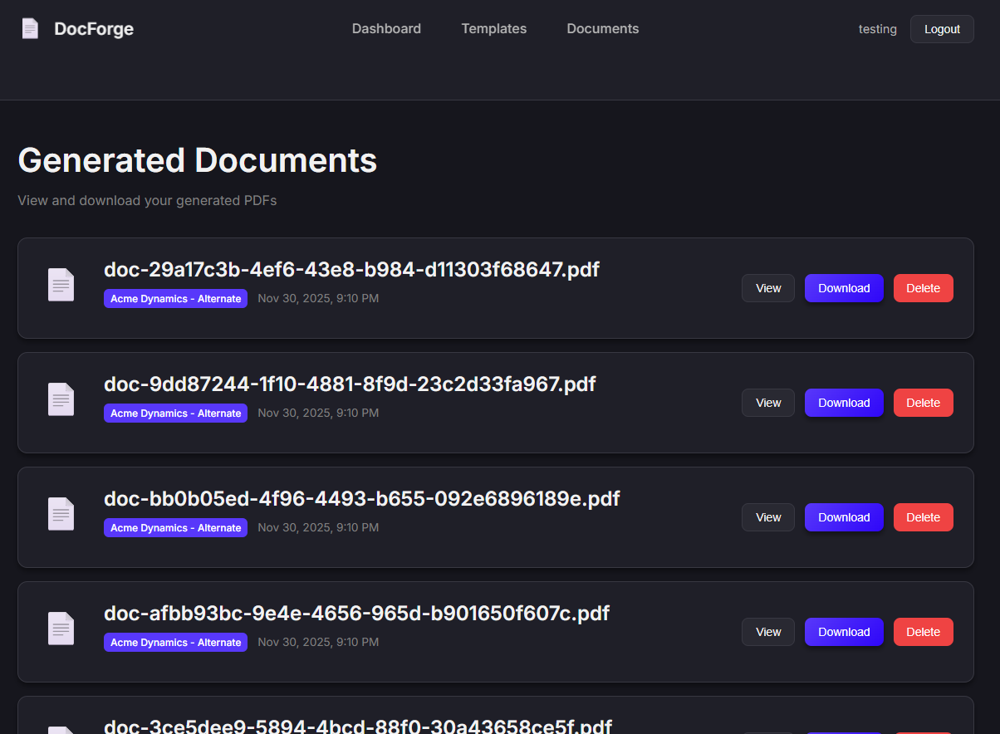
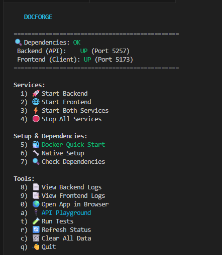
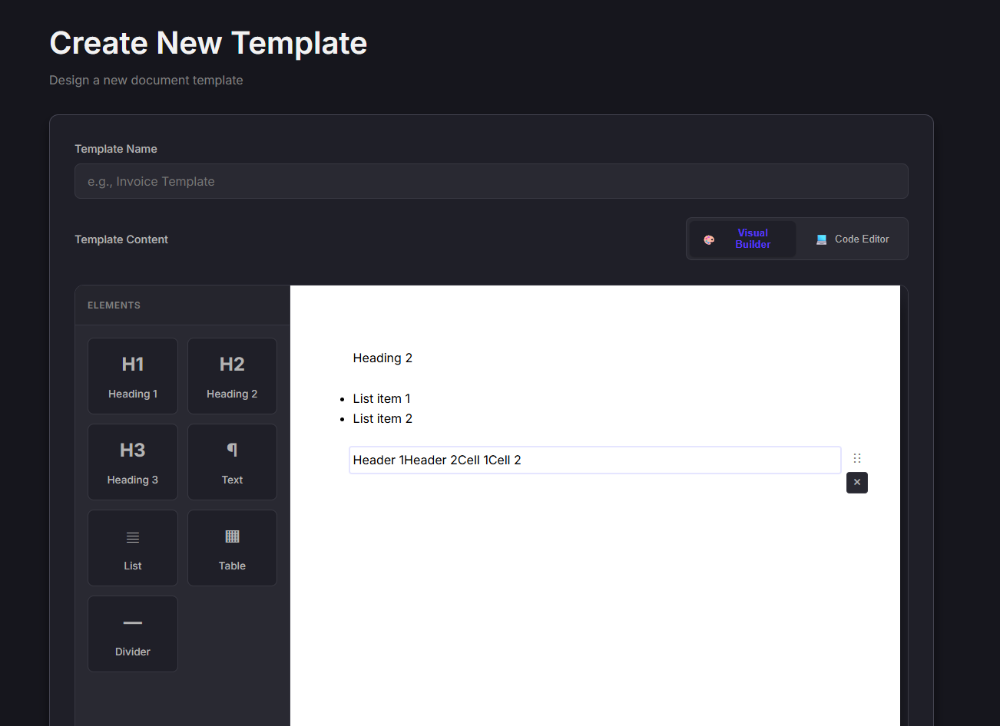

# DocForge


Stop fighting with PDF libraries. Write HTML templates, get PDFs back.


DocForge is a .NET 8 API + React frontend for generating PDFs from templates. You write HTML with Handlebars variables, POST your JSON data, get a PDF. That's it.

Good for invoices, reports, certificates - anything where the layout stays the same but the data changes.

## When to use DocForge

✅ You need PDFs with consistent layouts (invoices, certificates, reports)
✅ You want to write templates in HTML instead of fighting PDF libraries
✅ You need a visual editor for non-developers

❌ You need pixel-perfect print layouts (use LaTeX)
❌ You're generating simple text-only PDFs (use a simpler library)

## The Concept

```html
<!-- 1. Write a template -->
<h1>Invoice #{{invoiceNumber}}</h1>
<p>Total: ${{total}}</p>
```

```json
// 2. Send JSON data
{
  "invoiceNumber": "12345",
  "total": "250.00"
}
```

```bash
# 3. Call the API
curl -X POST http://localhost:5257/api/documents/generate \
  -H "Authorization: Bearer YOUR_JWT_TOKEN" \
  -H "Content-Type: application/json" \
  -d '{
    "templateId": "your-template-id",
    "data": {
      "invoiceNumber": "12345",
      "total": "250.00"
    }
  }'

# Response: {"id": "abc-123", "downloadUrl": "/api/documents/abc-123/download"}
```

**Result:** A formatted PDF invoice ready to download.



## Quick Start

(Requires Docker OR .NET 8 SDK + Node.js 18+)

**With Docker** (runs API only):
```bash
git clone https://github.com/jonmartin721/docforge-api.git
cd docforge-api
docker-compose up -d

# Then start the frontend separately
cd DocumentGenerator.Client
npm install
npm run dev
```

Then open:
- **Frontend**: http://localhost:5173
- **API**: http://localhost:5000/swagger

See [docs/DOCKER.md](docs/DOCKER.md) for volume mounts, environment variables, and production setup.

**Without Docker** (local development):
```bash
# Linux/WSL only: install Chrome dependencies first
sudo ./scripts/setup-linux.sh

# Backend (port 5257)
dotnet run --project DocumentGenerator.API

# Frontend (separate terminal, port 5173)
cd DocumentGenerator.Client && npm install && npm run dev
```

### Guided Setup (TUI)

Prefer a guided setup? We have a TUI that handles dependencies, services, testing, and Docker:

```bash
# Linux/macOS/WSL
chmod +x docforge.sh && ./docforge.sh

# Windows (PowerShell)
.\docforge.ps1
```



## Features

- **No PDF library wrestling** - Just write HTML/CSS like you already know
- **Visual editor included** - Build templates with drag-and-drop, see changes instantly
- **Works offline** - No external API calls, runs entirely on your infrastructure
- **Handles the hard parts** - Chrome rendering, proper fonts, page breaks that don't suck
- **Multi-user ready** - JWT auth built in, not bolted on later
- **Docker support** - API runs in container, frontend runs locally (Vite)

## Architecture

DocForge follows a clean architecture pattern with **4 projects**:

```
DocForge/
├── DocumentGenerator.API/          # Web API layer (Controllers, endpoints)
├── DocumentGenerator.Core/         # Business logic (Entities, DTOs, Validators)
├── DocumentGenerator.Infrastructure/ # Data access & services (EF Core, PDF generation)
├── DocumentGenerator.Tests/        # Unit and integration tests
└── DocumentGenerator.Client/       # React frontend (separate folder)
```

- **API**: Web controllers, authentication, Swagger documentation
- **Core**: Domain models, business rules, validation logic
- **Infrastructure**: Entity Framework, PuppeteerSharp PDF generation, external services
- **Tests**: xUnit tests with in-memory database for integration testing

## Template Syntax

Templates use Handlebars. If you've used Mustache, it's basically that.

**Variables**:
```html
<!-- Your template -->
<h1>Invoice #{{invoiceNumber}}</h1>
<p>Customer: {{customerName}}</p>
```

```json
// Your data
{
  "invoiceNumber": "INV-2024-001",
  "customerName": "Acme Corp"
}
```

**Result in PDF:**
```
Invoice #INV-2024-001
Customer: Acme Corp
```

**Loops**:
```html
<ul>
{{#each items}}
  <li>{{name}}: ${{price}}</li>
{{/each}}
</ul>
```

**Conditionals**:
```html
{{#if isPaid}}
  <span class="paid">✓ Paid</span>
{{else}}
  <span class="unpaid">Pending</span>
{{/if}}
```

Test your templates in the frontend editor first - it catches syntax errors before you hit the API.



## Tech Stack

**Backend:** .NET 8 API, Entity Framework Core (SQLite), PuppeteerSharp (headless Chrome), Handlebars.NET, JWT auth with refresh tokens

**Frontend:** React 19, Vite, drag-and-drop editor with @dnd-kit, Vitest for testing

Full dependency versions in `package.json` and `.csproj` files.

## API Endpoints

| Endpoint | Method | Auth | Description |
|----------|--------|------|-------------|
| `/api/auth/register` | POST | No | Create account |
| `/api/auth/login` | POST | No | Get JWT token |
| `/api/templates` | CRUD | Yes | Manage templates |
| `/api/documents/generate` | POST | Yes | Create PDF from template |
| `/api/documents/generate-batch` | POST | Yes | Create multiple PDFs from one template |
| `/api/documents/{id}/download` | GET | Yes | Download generated PDF |

**Full API docs:** Available at `/swagger` when running.

## Environment Configuration

Copy `.env.example` to `.env` and configure the following variables:

### Database
```bash
DATABASE_CONNECTION_STRING=Data Source=documentgenerator.db
```
- Default: SQLite database file in project root
- Can be changed to PostgreSQL or SQL Server connection strings

### JWT Authentication
```bash
JWT_SECRET=your-super-secret-key-minimum-32-characters
JWT_ISSUER=DocForge
JWT_AUDIENCE=DocForge
JWT_EXPIRATION_MINUTES=60
REFRESH_TOKEN_EXPIRATION_DAYS=7
```

### CORS Configuration
```bash
ALLOWED_ORIGINS=http://localhost:5173,http://localhost:3000
```

### Environment
```bash
ASPNETCORE_ENVIRONMENT=Development
```

**Production Considerations:**
- Use a strong JWT_SECRET (minimum 32 characters)
- Configure secure database connection strings
- Set appropriate CORS origins for your domain
- Use `ASPNETCORE_ENVIRONMENT=Production` for production deployments

## Learn More

- 📖 **API Documentation** - Available at `/swagger` when running
- 🎨 **Template Examples** - See [`DocumentGenerator.Client/src/`](DocumentGenerator.Client/src/) for the visual editor
- 🐳 **Docker Setup** - See [`docs/DOCKER.md`](docs/DOCKER.md) for container configuration
- 🏗️ **Architecture** - Clean architecture with .NET 8 API + React frontend

**Getting Help:** Open an issue at [github.com/jonmartin721/docforge-api/issues](https://github.com/jonmartin721/docforge-api/issues)

## Testing

```bash
# Backend
dotnet test

# Frontend
cd DocumentGenerator.Client && npm test

# With coverage
dotnet test --collect:"XPlat Code Coverage"
cd DocumentGenerator.Client && npm run test:coverage
```

Backend uses xUnit + FluentAssertions + Moq with in-memory SQLite. Frontend uses Vitest + Testing Library.

## Security Notes

- Passwords hashed with BCrypt (cost factor 12)
- JWT tokens for stateless auth
- Refresh tokens allow long-lived sessions without exposing credentials
- FluentValidation prevents injection attacks
- CORS properly configured for local dev

## Known Issues

See [open issues](https://github.com/jonmartin721/docforge-api/issues) for current bugs and areas that need testing. If you run into problems, please open an issue - it helps improve the project.

## Roadmap

Planned features (contributions welcome):
- Template versioning (save history)
- ✅ Bulk generation - Use `/api/documents/generate-batch`
- Cloud storage (S3/Azure instead of local disk)
- Template sharing (if there's interest)

## Contributing

PRs welcome - fork, branch, and open a PR. See [CONTRIBUTING.md](CONTRIBUTING.md) for commit conventions and guidelines.

## License

MIT - do whatever you want with it.


---

Made by [@jonmartin721](https://github.com/jonmartin721). PRs welcome.
